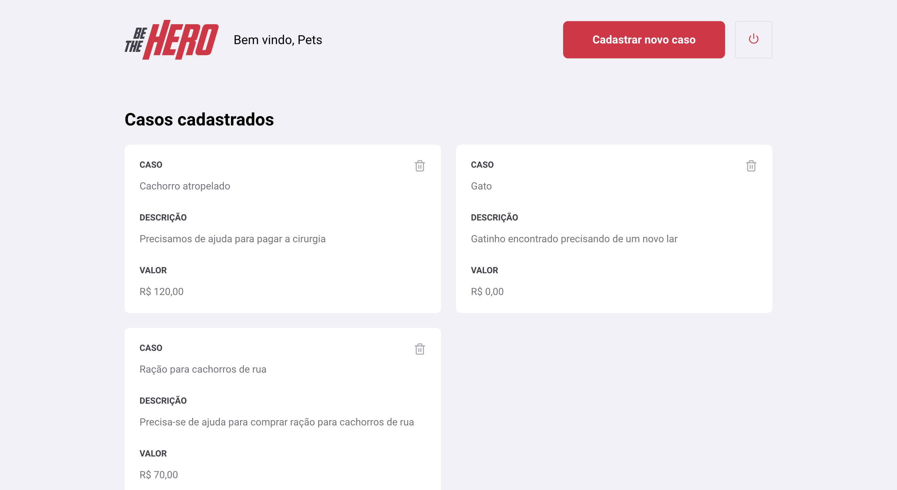
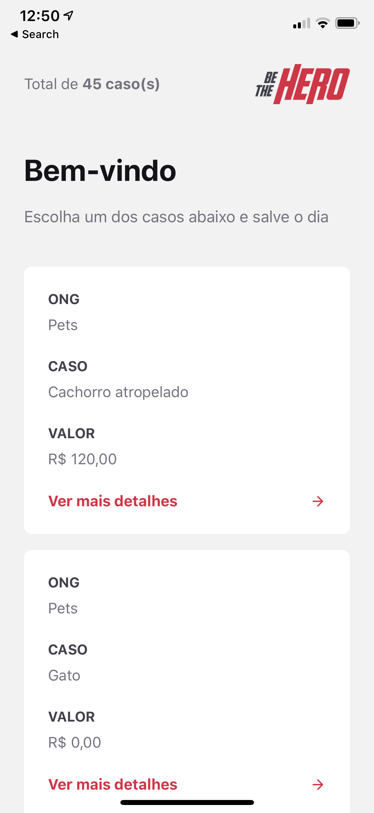

# BeTheHero

Be The Hero is an open source plataform (mobile and web) that ONGS can create a profile and share incidents with other people willing to help.  

  - Backend (NodeJS, Express)
  - Frontend (ReactJS)
  - Mobile (Expo)

## Stack
The platform is divided into 3 sections

### Backend
  * [NodeJs](https://nodejs.org/en/)
  * [Express](https://expressjs.com/)
  * [knexjs](http://knexjs.org/)

### Frontend
  * [ReactJS](https://reactjs.org/)

 

### Mobile
  * [React Native](https://reactnative.dev/)
  * [Expo](https://expo.io/)

 

### Installation

Requires [Node.js](https://nodejs.org/) v10+ to run.

Install the dependencies and start the backend.
```sh
$ cd backend 
$ npm install 
$ npm run start
```

Install the dependencies and start the frontend.
```sh
$ cd frontend
$ npm install 
$ npm run start
```


Install the dependencies and start the mobile.
```sh
$ cd mobile
$ npm install 
$ npm run start
```

### Future Features

* Add JWT
* Add more features to incidents
* Add more informations about the ONG
* ...

License
----

MIT
**Free Software**
